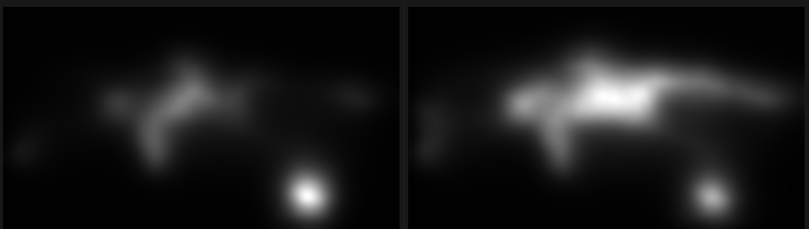
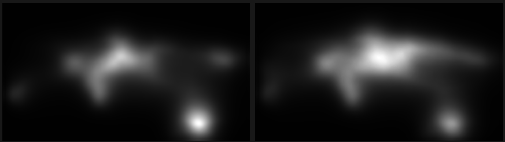

# STSANet-TRT
[Spatio-Temporal Self-Attention Network for Video Saliency Prediction](https://ieeexplore.ieee.org/document/9667292)

This repo is build on top of [STSANet](https://github.com/WZq975/STSANet) and modifies it for onnx/TRT inference. The default model doesn't export onnx out-of-the-box:
```console
torch.onnx.errors.UnsupportedOperatorError: Exporting the operator 'aten::max_unpool3d' to ONNX opset version 11 is not supported.
```

**Changes Made**:
1. Replaced `nn.MaxUnpool3d` with `nn.Upsample(scale_factor=(1, 2, 2), mode='nearest')`
2. Removed `indices` parameter from unpooling calls

**Impact**:
- Loses the exact spatial relationship information from MaxPool3d indices
- Has slight differences in output compared to original model

To reduce this difference, the model was retrained on DHF1K after modification. Nevertheless, the difference only increased and hence the default model was used moving forward. Because the unpooling layer doesn't consist of weights, the author's original weights can be used with our new model definition.

## Training
Check official repo.

## Export to ONNX & TRT
```
# export to onnx
python3 export_onnx.py

# export trt FP16 engine
/usr/src/tensorrt/bin/trtexec --onnx=STSANet_DHF1K.onnx --saveEngine=STSANet_DHF1K.engine --fp16
```

## Inference
### PyTorch
```console
python3 infer_pth.py 
# Processed 625 frames in 51.28 seconds.
# Total inference calls: 594
# Average inference time per frame: 18.52 ms
# Total inference time: 11.00 seconds.
# Overlayed and saliency videos saved to output/pth
```

### TRT
```console
python3 infer_trt.py 
# Processed 625 frames in 47.28 seconds.
# Total inference calls: 594
# Average inference time per frame: 12.05 ms
# Total inference time: 7.16 seconds.
# Overlayed and saliency videos saved to ./output/trt
```

# Conclusion (How much accuracy does the TRT version lose?)
The original PyTorch version is compared with the TRT-FP16 version using 2 metrics: MAE and Euclidean-Offset. MAE indicates the deterioration in mask pixel intensity in entire image while the Euclidean-Offset answers how much the centroid of the brighest blob has shifted (useful in my usecase).  

**MAE**

*(Left: torch, Right: TRT-FP16)*
```console
--- MAE Analysis (Lower is Better) ---
Matched frames: 594
Mean MAE: 6.94
Std MAE:  2.89
Min MAE:  2.45
Max MAE:  18.22
```

**Euclidean-Offset**

```
--- Focal Point Offset Analysis (Lower is Better) ---
Mean Offset (pixels): 118.38
Std Offset (pixels):  170.65
Min Offset (pixels):  1.00
Max Offset (pixels):  766.86
```

## Citation
```
@article{wang2021STSANet,
  author={Wang, Ziqiang and Liu, Zhi and Li, Gongyang and Wang, Yang and Zhang, Tianhong and Xu, Lihua and Wang, Jijun},
  journal={IEEE Transactions on Multimedia}, 
  title={Spatio-Temporal Self-Attention Network for Video Saliency Prediction}, 
  year={2023},
  volume={25},
  pages={1161-1174},
  doi={10.1109/TMM.2021.3139743}
}

```
## Acknowledgements
The repo is based on the [original implementation of STSANet](https://github.com/WZq975/STSANet).
